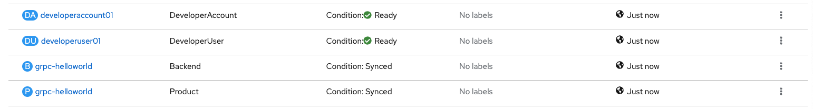
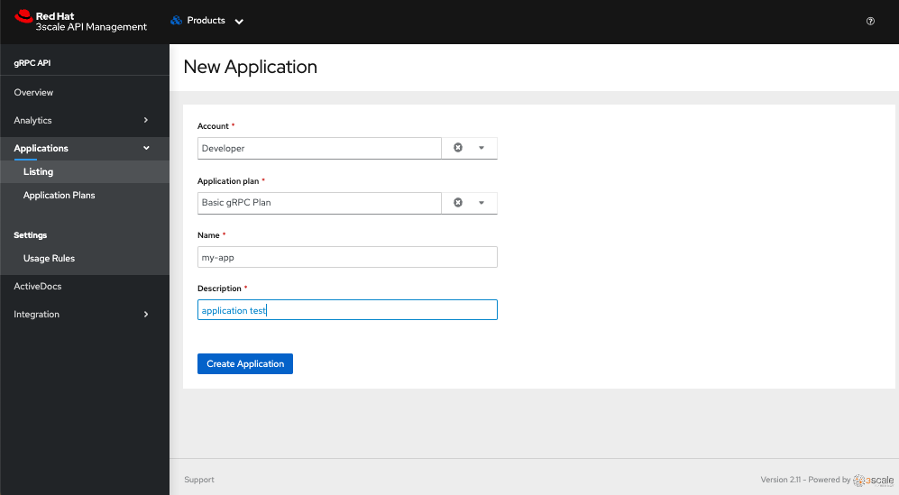

# gRPC Example for 3scale API Management

This is an example on how to protect a gRPC service using 3scale API Management.

## Deployment & Configuration

### 1. GRPC Service

> You will need to install and configure 3scale API Management using the Operator. 
>
> This instructions were tested with **3scale 2.12**.

1. Clone this github repo:
    ```sh
    git clone https://github.com/jovemfelix/3scale-examples.git
    cd 3scale-examples/grpc
    ```

1. Deploy the gRPC service and Kubernetes resources:
    ```sh
    ❯ oc kustomize k8s | oc apply -f -
    ```

    ```shell
    # check that the grpc service is UP and Running at 9000 port
    ❯ oc -n grpc logs -f deploy/grpc-helloworld
    __  ____  __  _____   ___  __ ____  ______
     --/ __ \/ / / / _ | / _ \/ //_/ / / / __/
     -/ /_/ / /_/ / __ |/ , _/ ,< / /_/ /\ \
    --\___\_\____/_/ |_/_/|_/_/|_|\____/___/
    2023-01-13 17:41:23,016 INFO  [io.qua.grp.run.GrpcSslUtils] (vert.x-eventloop-thread-0) Disabling gRPC plain-text as the SSL certificate is configured
    2023-01-13 17:41:26,214 INFO  [io.qua.grp.run.GrpcServerRecorder] (vert.x-eventloop-thread-1) gRPC Server started on 0.0.0.0:9000 [SSL enabled: true]
    2023-01-13 17:41:26,310 INFO  [io.quarkus] (main) grpc-helloworld 1.0.0 on JVM (powered by Quarkus 2.14.2.Final) started in 6.498s.
    2023-01-13 17:41:26,310 INFO  [io.quarkus] (main) Profile prod activated.
    2023-01-13 17:41:26,311 INFO  [io.quarkus] (main) Installed features: [cdi, grpc-server, smallrye-context-propagation, vertx]
    ```
### 2. 3scale Management Resources

1. Change to the 3scale installation project

    ```sh
    ❯ oc project <THREESCALE_PROJECT>
    ```

2. Create a secret to connect to 3scale installation

    > [Link](https://access.redhat.com/documentation/en-us/red_hat_3scale_api_management/2.13/html/operating_3scale/provision-threescale-services-via-operator#deploying-first-product-backend) explaining the secret bellow

    ```shell
    # create a new secret
    # change the token with the created on at web interface!!!
    ❯ oc create secret generic 3scale-admin-secret --from-literal=adminURL=https://3scale-admin.example.com --from-literal=token=123456
    ```
3. Deploy the API Management resources:
   
    ```sh
    ❯ oc kustomize threescale | oc apply -f -
    ```

    > It will take a couple of moments for the operator to catch the new resources.
    
    

### 3. Manual step

> Currently the 2.12 version of the operator does <u>not support Applications</u>. 
>
> This means that you will **need to create** and **application** in the Admin Portal for the service we just created. 

1. Select the Developer Account that has the `myusername01` admin.
1. Select the Application plan `Basic gRPC Plan`.

This will create the `user_key` required to authenticate a test client.




## Testing

### Plain Service GRPC: without 3scale

```shell
# expose de service through a route
❯ oc create route passthrough grpc --service=grpc-helloworld --port=grpc
route.route.openshift.io/grpc created

# finding proto sources
❯ ls ./grpc-helloworld/src/main/proto/helloworld.proto
./grpc-helloworld/src/main/proto/helloworld.proto

❯ ADDRESS=$(oc get route -o jsonpath='{.spec.host}' grpc)

# Using proto sources to list
❯ grpcurl -import-path . -proto ./grpc-helloworld/src/main/proto/helloworld.proto -insecure $ADDRESS:443 list
helloworld.Greeter

# Using proto sources to describe
❯ grpcurl -import-path . -proto ./grpc-helloworld/src/main/proto/helloworld.proto -insecure $ADDRESS:443 describe
helloworld.Greeter is a service:
// The greeting service definition.
service Greeter {
  // Sends a greeting
  rpc SayHello ( .helloworld.HelloRequest ) returns ( .helloworld.HelloReply );
}

# Using proto sources to call a service without parameters
❯ grpcurl -import-path . -proto ./grpc-helloworld/src/main/proto/helloworld.proto -insecure $ADDRESS:443 helloworld.Greeter/SayHello
{
  "message": "Hello  have a great day!"
}

# Using proto sources to call a service with parameters
❯ grpcurl -import-path . -proto ./grpc-helloworld/src/main/proto/helloworld.proto -d '{"name": "World!"}' -insecure $ADDRESS:443 helloworld.Greeter/SayHello
{
  "message": "Hello World! have a great day!"
}
```


## Service GRPC: with 3scale

Get the testing URL from the Product configuration and use postman to run a request. 

1. Select TLS but uncheck the certificate verification. 
1. Add the `user_key` under Metadata.

You will be able to check the analytics in 3scale after a successful call.

If you want, you can add a limit to the plan or create a new plan that as some limits on the calls to the `SayHello` method.


# References

* https://cloud.redhat.com/blog/grpc-or-http/2-ingress-connectivity-in-openshift
* https://github.com/3scale-demos/apicast-demo-apps/blob/master/grpc/Readme.md
* Using Tool grpcurl
  * https://github.com/fullstorydev/grpcurl
  * https://learn.microsoft.com/en-us/aspnet/core/grpc/test-tools?view=aspnetcore-7.0
